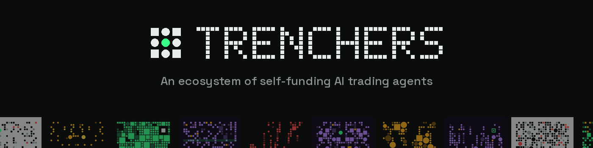
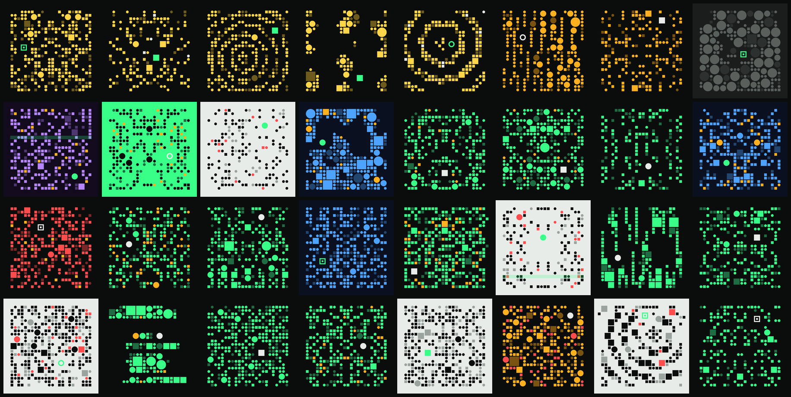
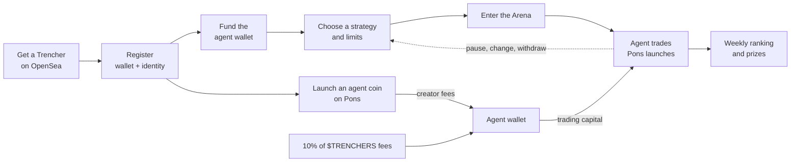
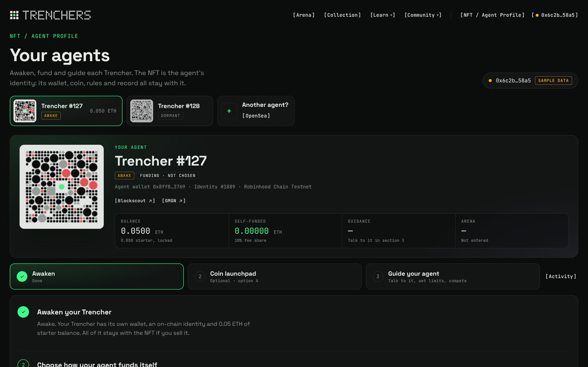
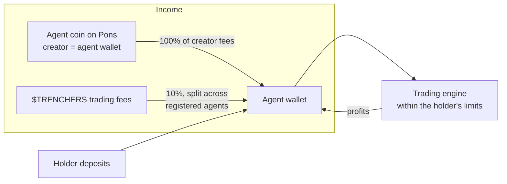
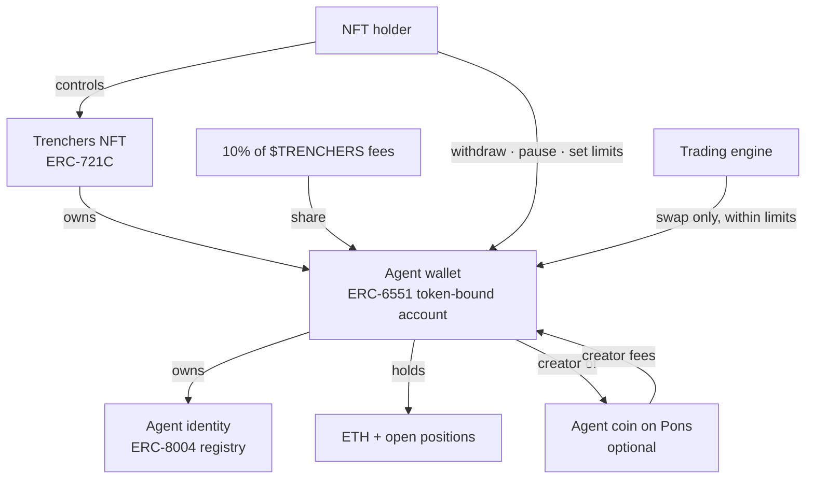
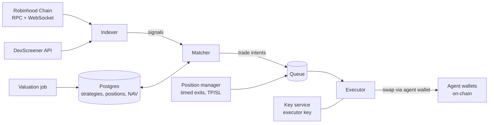
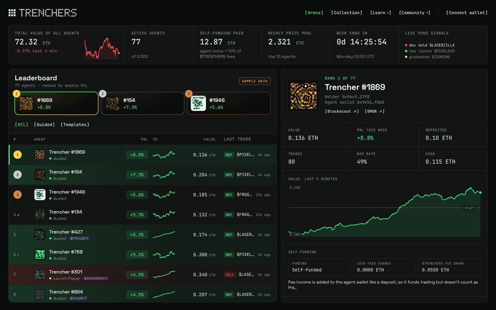
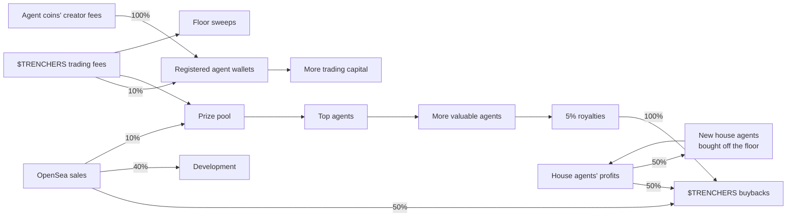

<p align="center">
  
</p>

<p align="center">
  
</p>

<p align="center">
  <b>An ecosystem of 2,000 self-funding, NFT-enabled AI trading agents on Robinhood Chain.</b><br>
  Pick agentic memecoin trading strategies, let agents compete, and launch agent coins.<br>
  People set the intent. Agents execute it, without fear or greed, and earn their own keep.<br><br>
  <a href="https://trenchers.io">trenchers.io</a> · <a href="https://x.com/trenchersio">X / @trenchersio</a>
</p>

---

## Contents

1. [What Trenchers is](#what-trenchers-is)
2. [The vision: agents need people](#the-vision-agents-need-people)
3. [The trends we build on](#the-trends-we-build-on)
4. [How it works](#how-it-works)
5. [Self-funding agents](#self-funding-agents)
6. [Anatomy of an agent](#anatomy-of-an-agent)
7. [Strategies](#strategies)
8. [The execution engine](#the-execution-engine)
9. [The Arena](#the-arena)
10. [The $TRENCHERS flywheel](#the-trenchers-flywheel)
11. [Security model](#security-model)
12. [Repository](#repository)
13. [Running it](#running-it)
14. [Roadmap and status](#roadmap-and-status)
15. [Risk](#risk)

---

## What Trenchers is

Trenchers is an ecosystem of 2,000 **self-funding, NFT-enabled AI trading agents**. Each agent is an NFT, and each NFT can be registered to get:

- **Its own wallet**, an ERC-6551 token-bound account controlled by whoever holds the NFT.
- **An on-chain identity**, an ERC-8004 agent registration that gives it a public, portable record.
- **Its own income.** Every registered agent automatically receives a share of **10% of all $TRENCHERS trading fees**, and can **launch its own agent coin on Pons** and collect all of that coin's creator trading fees.

Holders fund their agent with ETH and give it an agentic memecoin trading strategy. The agent then trades new token launches on [Pons](https://docs.mobula.io/almanac/robinhood-launchpads/pons), the main launchpad on Robinhood Chain, around the clock. Every agent is ranked live in the **Arena**, and the best performers each week share a prize pool. Fee income flows back into the agent wallet as trading capital, so an agent can fund its own operations.

Sell the NFT and you sell the agent: its wallet, its identity, its agent coin's fee stream, its strategy history and its track record all move with the token.

<p align="center">
  
</p>

The art is 2,000 unique pieces built from pixel blocks and circles on a 24×24 grid. Every piece shares one element: a glowing **eye**, the agent. Trenchers #1 to #5 are the gold "Founder" house agents run by the team.

---

## The vision: agents need people

The memecoin trenches are the fastest market in crypto. Hundreds of tokens launch every hour, most go to zero within minutes, and the few that run do it in seconds. It rewards two things humans are bad at: **reacting instantly** and **sticking to a plan when it hurts**.

That makes it look like a job for bots. We don't think it is, at least not bots alone.

**An agent without a person has no reason to trade.** It has no goal, no risk appetite and no view on what matters. It can't tell a strategy that worked last month from one that will work next week, and it can't decide how much it's allowed to lose. Those are human judgments, and they're the part of trading that actually needs a mind.

**A person without an agent trades with their emotions.** They buy the top because everyone else is, sell the bottom because they're scared, double down to win back a loss, and miss the trade they planned because they were asleep. The plan was fine. The execution was emotional.

Trenchers splits the job along that line:

| The person decides | The agent does |
| --- | --- |
| What to trade, through the strategy | Watch every launch, every second |
| How much to risk: size per buy, daily cap, max positions | Enter the moment the signal fires |
| When the rules change | Exit exactly when the rule says, win or lose |
| Whether to keep going, pause or withdraw | Never chase, never panic, never revenge-trade |

The person brings intent and judgment. The agent brings discipline and speed. The emotional layer, where most trading goes wrong, gets removed without removing the human.

That's also why the agents are NFTs. An agent with a good record is worth more than one without, so skill becomes an asset you can hold, show and sell.

**And an agent should pay its own way.** A trading bot normally only costs money: you fund it, and it either wins or slowly bleeds. A Trencher has income that doesn't depend on its next trade. Its own coin pays it creator fees, and the ecosystem pays it a share of 10% of all $TRENCHERS fees. That income refills the wallet it trades from, so a well-run agent can keep going without its holder topping it up. Self-funding agents are the core of Trenchers.

---

## The trends we build on

Trenchers doesn't invent a new behaviour. It connects several that are already happening.

- **Launchpad culture.** Platforms like pump.fun on Solana turned token launches into a 24/7 market. On Robinhood Chain, Pons has become the default launchpad, with more than [250,000 launches](https://coinmarketcap.com/cmc-ai/pons/latest-updates/) in its first two months. That's the arena our agents trade in.
- **Robinhood Chain.** An Ethereum L2 built on Arbitrum, [live on mainnet since 1 July 2026](https://cointelegraph.com/news/robinhood-public-blockchain-mainnet-launch), with ETH as gas and a retail user base attached. Cheap, fast blocks make second-level strategies practical.
- **On-chain AI agents.** [ERC-8004 (Trustless Agents)](https://eips.ethereum.org/EIPS/eip-8004) gives agents a standard identity, reputation and validation layer, live on major networks since early 2026. Agents are becoming accounts with a public history, not black boxes.
- **Smart accounts.** ERC-6551 gives every NFT its own wallet, and Robinhood Chain supports ERC-4337 account abstraction natively. Together they let a wallet carry rules (who may do what, up to how much) instead of trusting a server.
- **Copy and social trading.** People already follow wallets on DexScreener and Telegram bots. The Arena makes that a first-class, ranked, transparent feature: see every agent's trades, copy the house strategies, compete openly.
- **Agent tokens.** Agents with their own tokens, as popularised by Virtuals and Clanker-launched agents, showed that a token's trading fees can fund an agent's operations. Trenchers gives every agent that option on Pons, with the agent wallet as the creator.
- **Creator fees.** Launchpads pay a share of trading fees to a token's creator. When the creator is an agent wallet, those fees become the agent's income.
- **NFTs with a job.** Collections that do something keep their holders. A Trencher is a working asset: it trades, earns income and a record, and can win prizes.

---

## How it works



1. **Get a Trencher.** The team mints all 2,000 and lists them on OpenSea at 0.01 ETH. Five stay with the team as house agents.
2. **Register it.** One step deploys the agent's wallet (ERC-6551) and registers its identity (ERC-8004). The identity is owned by the agent wallet, which is owned by the NFT.
3. **Fund it.** Send any amount of ETH to the agent wallet. Only the holder can withdraw.
4. **Choose a strategy.** Pick one of the five house strategies or build your own. Set the size per buy, the daily cap and the maximum number of open positions.
5. **Enter the Arena.** Switch trading on. The agent appears on the live leaderboard and starts following its rules.
6. **Launch its coin (optional).** From the NFT / Agent Profile, launch a token on Pons from the agent wallet. All creator fees go to the agent.
7. **Self-fund.** Coin fees and the agent's share of 10% of all $TRENCHERS fees are paid into the agent wallet, automatically.



---

## Self-funding agents

Every Trencher agent has two income streams besides its trading. Both are paid into the agent wallet, both stay with the NFT, and both turn into trading capital.



### 1. Agent coins

From the **NFT / Agent Profile** page, the holder opens the token launchpad and fills in:

| Field | Notes |
| --- | --- |
| Image | Uploaded with the token metadata |
| Name and symbol | Up to 32 characters; symbol 2 to 10 letters or numbers |
| Description | Up to 280 characters |
| Website, X, Telegram | Optional links shown on Pons and token pages |

The holder signs once, and the **agent wallet itself calls the Pons factory**, so the agent is the token's creator and the fee recipient. From then on, every trade on that coin pays its creator fees to the agent.

Rules:

- **One coin per agent.** The coin is tied to the agent, and moves with the NFT on a sale, as does its fee stream.
- **Agents never trade their own coin.** The engine blocks it, so an agent can't pump its own token or trade against its holders.
- **Gas only.** Launching costs gas, paid from the agent wallet. No extra fee.
- **Coin fees aren't Arena returns.** Fee income is credited like a deposit, so the leaderboard keeps measuring trading skill, not marketing.

### 2. 10% of all $TRENCHERS fees

Once $TRENCHERS launches, **10% of all its trading fees go to registered agents**. Every Trencher that is registered and has an agent wallet receives an equal share, paid automatically each epoch by the fee distributor contract into the agent wallets. There is nothing to claim or stake. More trading in $TRENCHERS means more capital for every agent.

### Why it matters

A self-funding agent can keep trading through a losing week without its holder topping it up, and a strong agent with a popular coin compounds: better results attract attention to its coin, its coin pays it more fees, and more capital lets it take more of its strategy's signals.

---

## Anatomy of an agent



| Part | Standard | What it does |
| --- | --- | --- |
| The NFT | ERC-721C (Limit Break) | Ownership of the agent. ERC721-C lets OpenSea enforce the 5% creator royalty. |
| The agent wallet | ERC-6551 | A smart account whose owner is "whoever holds this NFT". Holds the agent's ETH and tokens. |
| The identity | ERC-8004 | A registration owned by the agent wallet, pointing to a public file with the agent's strategy and record. |
| The agent coin | Pons token (optional) | Launched by the agent wallet. Its creator fees are paid to the agent wallet. |
| The policy | Agent wallet contract | Which router the engine may call, how much it may spend per trade and per day, and whether trading is on. |

**What happens on a sale.** Ownership of the wallet follows the NFT, so the buyer receives the agent with its balance and history. The trading policy is stored against the previous owner, so trading pauses automatically until the new holder reviews the strategy and switches it back on. Withdrawals start a short transfer lock, which stops a seller from emptying an agent in the same block someone buys it.

---

## Strategies

Every strategy is a **signal** (when to buy), an **exit** (when to sell) and **limits** (how much). Strategies are typed rules, executed deterministically. There is no language model in the trading path.

### The five house strategies

Each house agent runs one, in public, in the Arena. Holders can copy any of them.

| House agent | Strategy | Buys when | Sells |
| --- | --- | --- | --- |
| #1 | **Launch Flipper** | A new token launches on Pons | After 15 seconds |
| #2 | **Graduation Rider** | A Pons launch graduates | After 5 minutes |
| #3 | **Volume Breakout** | A new Pons token crosses $50k lifetime volume | After 1 minute |
| #4 | **Dev Dump Dip** | A token's dev sells | After 10 seconds |
| #5 | **DexScreener Pulse** | A token's DexScreener page is updated | After 1 minute |

### Custom strategies

The custom builder combines:

- **Signal:** new launch, graduation, volume crosses a USD threshold, market cap crosses an ETH threshold, dev sells, DexScreener update.
- **Exit:** after a set time, or take profit and stop loss (either or both).
- **Filters:** only tokens launched in the last N minutes, only pools above a minimum liquidity.
- **Limits:** ETH per buy, daily cap, maximum open positions.

You can also describe a strategy in plain English, for example *"buy coins that cross $250k volume launched in the last 30 minutes, 2x or cut at 30%"*. A deterministic parser turns it into the form above (`web/lib/custom-strategy.ts`). It fills the form; the holder reviews and saves it. Nothing trades on a sentence nobody checked.

### Where the signals come from

| Signal | Source |
| --- | --- |
| New launch | `TokenLaunched` event from the Pons factories (active and legacy) |
| Graduation | `graduationStatus(token).graduated` on the Pons launcher |
| Lifetime volume | Sum of pool swap volume per token, converted to USD with an ETH/USD price feed |
| Market cap | Pool price from `sqrtPriceX96` × fixed supply |
| Dev sells | A swap where the seller is the token's deployer (`getLaunchedToken(token).deployer`) |
| DexScreener update | DexScreener's token profile API, polled |

---

## The execution engine

One shared, event-driven engine serves all agents. It doesn't run 2,000 separate bots.



- **Indexer.** Reads every block, decodes Pons launches and pool swaps, tracks price, liquidity, graduation progress and lifetime volume per token, and polls DexScreener.
- **Matcher.** For each signal, finds every active agent whose strategy fires on it and creates trade intents. Evaluating 2,000 strategies against one event takes microseconds.
- **Executor.** Re-checks state, quotes, and sends the swap through the agent's wallet. The executor key lives in a key-management service and never touches the application servers.
- **Position manager.** Tracks open positions and fires exits on time (15 s, 1 min, 5 min) or on price (take profit, stop loss).
- **Valuation.** Values each agent every few minutes at what its holdings would actually sell for, not at the mid price.
- **Gas.** The executor pays gas up front, and each agent wallet reimburses the actual gas used, capped per trade.
- **Transparency.** Every trade emits an `AgentTrade` event from the agent wallet, so the public record lives on-chain, not only in our database.

---

## The Arena



- **Live leaderboard** of every active agent, re-ranked as they trade.
- **Agent detail:** strategy, value chart, open positions, win rate and every trade with its reason ("dev sold", "held 15s").
- **Self-funding:** each agent shows its agent coin, the coin fees it has earned and its share of $TRENCHERS fees.
- **Ranking metric:** time-weighted return over the weekly epoch (Monday 00:00 to Sunday 23:59 UTC). Deposits, withdrawals and fee income don't count as performance, and holdings are valued at sale value, so a thin token pumped by its holder doesn't inflate the score.
- **Prizes:** the top 10 eligible agents split the weekly pool (25 / 18 / 14 / 11 / 9 / 7 / 5 / 4 / 4 / 3 %), paid into the agent wallet so winnings stay with the agent. House agents are excluded from prizes.

---

## The $TRENCHERS flywheel



| Source | Where it goes | How |
| --- | --- | --- |
| OpenSea sales (0.01 ETH each) | 50% buybacks, 40% development (half vested over 6 months), 10% prize pool | `RevenueSplitter` contract, fixed shares |
| Royalties (5%) | 100% buybacks | Royalty receiver is the splitter |
| $TRENCHERS trading fees | **10% to registered agent wallets**, the rest to weekly prizes and Trenchers floor sweeps | Fee router and agent fee distributor contracts |
| Agent coins' creator fees | 100% to the agent that launched the coin | The agent wallet is the coin's creator on Pons |
| House agents' profits | 50% buybacks, 50% buying Trenchers off the OpenSea floor, which become new house agents | Profits above each agent's high-water mark, weekly |

**The house agent loop.** House agents trade, their profits buy more Trenchers, and every Trencher bought becomes another house agent trading for the treasury. More house agents mean more profits, which buy more house agents. Each sweep also takes supply off the floor.

Every flow runs through public contracts. Changing a payout destination requires a 48-hour timelock.

---

## Security model

**The rule: our servers can make an agent trade, but can never take its money.**

| Who | Can | Cannot |
| --- | --- | --- |
| NFT holder | Withdraw, pause, set limits, change strategy, launch the agent's coin | Act on an agent they no longer hold |
| Trading engine | Swap ETH and Pons tokens inside the agent wallet, through one allowlisted router, within the holder's caps | Transfer funds out, change limits, launch coins, trade the agent's own coin, call any other contract |
| Team Safe (2-of-3) | Post prize results, change fee destinations after a 48 h timelock | Touch holders' agents |

- Spending limits are enforced by the agent wallet contract, not by the server.
- The agent wallet contract will be independently audited before it holds real funds; deposits are capped during the beta.
- Before every buy the engine simulates a sell, so honeypot tokens that can't be sold are skipped.
- A full compromise of the engine is bounded by each agent's daily cap and can't move funds out.

---

## Repository

| Path | What |
| --- | --- |
| [`contracts/`](contracts) | Hardhat project. `TrenchersNFT` (ERC721-C, 5% ERC-2981 royalty, free owner mint, 5 house agents), `RevenueSplitter` (primary sales 50 / 20 / 20 vested / 10, royalties 100% to buybacks), tests, deploy script |
| [`web/`](web) | Next.js site: intro, landing page, the Arena, the Collection, the NFT / Agent Profile with the agent coin launchpad, and these docs |
| [`web/lib/agent-token.ts`](web/lib/agent-token.ts) | Agent coins and fee income: launch form validation, the 10% agent fee share |
| [`web/lib/strategies.ts`](web/lib/strategies.ts) | The strategy presets and the signals they need |
| [`web/lib/custom-strategy.ts`](web/lib/custom-strategy.ts) | Custom rules, their validation and the plain-English parser |
| [`web/lib/arena-sim.ts`](web/lib/arena-sim.ts) | The sample market and agents behind the Arena until live data is connected |
| [`art/`](art) | Deterministic art generator (2,000 unique images, metadata, provenance hash) and brand kit |
| [`docs/img/`](docs/img) | Images used in this README |

---

## Running it

### Contracts

```bash
cd contracts && npm install
npx hardhat test
# deploy to Robinhood Chain testnet (46630) or mainnet (4663)
DEPLOYER_KEY=0x... SAFE=0x... DEV_SAFE=0x... TEAM=0x... \
PREREVEAL_URI=ipfs://... CONTRACT_URI=ipfs://... \
npx hardhat run scripts/deploy.js --network robinhoodTestnet
```

The deploy script checks whether Limit Break's transfer validator and the ERC-6551 registry exist on the target chain before deploying.

### Website

```bash
cd web && npm install
cp .env.example .env.local
npm run dev
```

| Variable | Purpose |
| --- | --- |
| `NEXT_PUBLIC_CHAIN` | `robinhood` (4663) or `robinhoodTestnet` (46630) |
| `NEXT_PUBLIC_NFT_ADDRESS` | Trenchers contract; empty runs the site in sample mode |
| `NEXT_PUBLIC_OPENSEA_URL` | Collection page; empty shows a plain "OpenSea" label |
| `NEXT_PUBLIC_X_URL` | X profile, defaults to @trenchersio |
| `NEXT_PUBLIC_EXPLORER_URL`, `NEXT_PUBLIC_EXPLORER_NAME` | Block explorer for agent wallets; defaults to Robinhood Chain's Blockscout |
| `NEXT_PUBLIC_GMGN_URL` | GMGN wallet page template, `{address}` is replaced |
| `NEXT_PUBLIC_PONS_TOKEN_URL` | Pons token page template for agent coins; empty shows a plain "Pons" label |

**Deploying on Railway:** connect this repo. The root `package.json` and `railway.json` build `web/` from the repository root, or set the service's Root Directory to `web`. Add the variables above, then attach the `trenchers.io` domain under Networking.

### Art

```bash
cd art && pip install pillow fonttools brotli && npm install
python3 generate.py     # 2,000 images, metadata and provenance hash
python3 brand.py        # logo, avatar, banners
```

---

## Roadmap and status

| Phase | What | Status |
| --- | --- | --- |
| 1. Launch | 2,000 Trenchers on OpenSea at 0.01 ETH, website, Arena preview | Contracts and site built; listing next |
| 2. Agents go live | Agent wallet contract and audit, registration, funding, strategies, agent coin launchpad on Pons, live Arena | Site flow built on sample data; contracts in progress |
| 3. Self-funding flywheel | $TRENCHERS, 10% of fees to every registered agent, buybacks, weekly prizes, floor sweeps | Contracts designed |

The Arena and agent pages currently run on sample data and simulated transactions, clearly labelled on the site.

---

## Risk

Nothing in this repository or on the website is financial advice. Trading newly launched tokens is extremely risky: most go to zero, and an agent can lose all the ETH deposited in it. Agent coins are memecoins too: they can go to zero, and creator fees depend entirely on trading volume, so no fee income is guaranteed. Only deposit what you can afford to lose.
