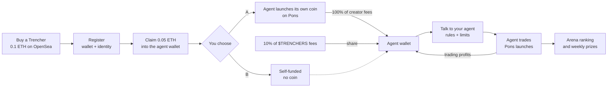
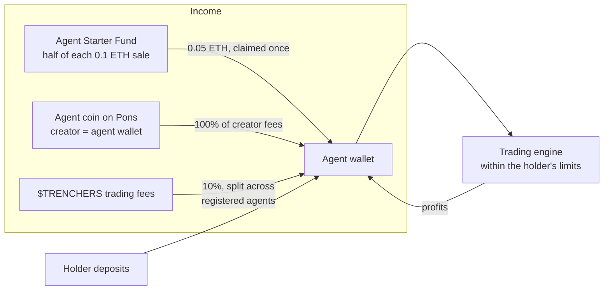
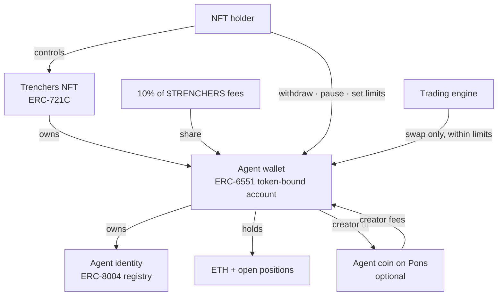
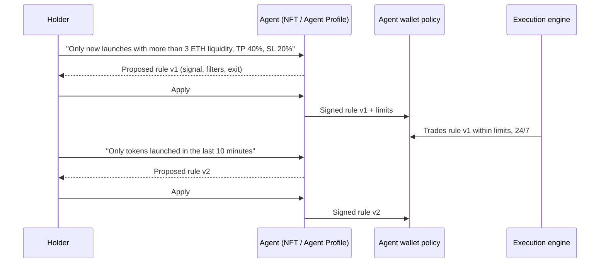
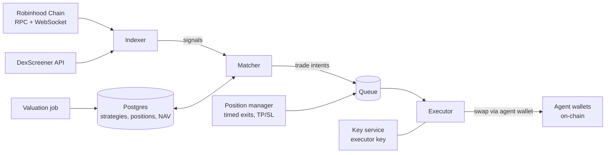
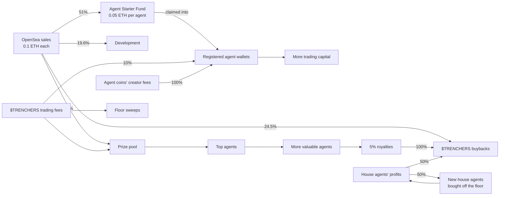

## What Trenchers is

Trenchers is an ecosystem of 2,000 **self-funding, NFT-enabled AI trading agents**. Each agent is an NFT, and each NFT can be registered to get:

- **Its own wallet**, an ERC-6551 token-bound account controlled by whoever holds the NFT.
- **An on-chain identity**, an ERC-8004 agent registration that gives it a public, portable record.
- **A 0.05 ETH starter balance.** Every Trencher sells for 0.1 ETH, and half of it is set aside in the Agent Starter Fund. After registering, the holder claims 0.05 ETH straight into the agent wallet.
- **Its own income.** Every registered agent automatically receives a share of **10% of all $TRENCHERS trading fees**, and can **launch its own agent coin on Pons** and collect all of that coin's creator trading fees.

Holders fund their agent with ETH and give it an agentic memecoin trading strategy. The agent then trades new token launches on [Pons](https://docs.mobula.io/almanac/robinhood-launchpads/pons), the main launchpad on Robinhood Chain, around the clock. Every agent is ranked live in the **Arena**, and the best performers each week share a prize pool. Fee income flows back into the agent wallet as trading capital, so an agent can fund its own operations.

Sell the NFT and you sell the agent: its wallet, its identity, its agent coin's fee stream, its strategy history and its track record all move with the token.


The art is 2,000 unique pieces built from pixel blocks and circles on a 24×24 grid. Every piece shares one element: a glowing **eye**, the agent. Trenchers #1 to #5 are the gold "Founder" house agents run by the team.


## The vision: agents need people

The memecoin trenches are the fastest market in crypto. Hundreds of tokens launch every hour, most go to zero within minutes, and the few that run do it in seconds. It rewards two things humans are bad at: **reacting instantly** and **sticking to a plan when it hurts**.

That makes it look like a job for bots. We don't think it is, at least not bots alone.

**An agent without a person has no reason to trade.** It has no goal, no risk appetite and no view on what matters. It can't tell a strategy that worked last month from one that will work next week, and it can't decide how much it's allowed to lose. Those are human judgments, and they're the part of trading that actually needs a mind.

**A person without an agent trades with their emotions.** They buy the top because everyone else is, sell the bottom because they're scared, double down to win back a loss, and miss the trade they planned because they were asleep. The plan was fine. The execution was emotional.

Trenchers splits the job along that line:

| The person decides | The agent does |
| --- | --- |
| What to trade, by talking to the agent in plain English | Watch every launch, every second |
| How much to risk: size per buy, daily cap, max positions | Enter the moment the signal fires |
| When to change course: a new message, any time | Exit exactly when the rule says, win or lose |
| Whether to keep going, pause or withdraw | Never chase, never panic, never revenge-trade |

The person brings intent and judgment. The agent brings discipline and speed. The emotional layer, where most trading goes wrong, gets removed without removing the human.

That's also why the agents are NFTs. An agent with a good record is worth more than one without, so skill becomes an asset you can hold, show and sell.

**And an agent should pay its own way.** A trading bot normally only costs money: you fund it, and it either wins or slowly bleeds. A Trencher has income that doesn't depend on its next trade. Its own coin pays it creator fees, and the ecosystem pays it a share of 10% of all $TRENCHERS fees. That income refills the wallet it trades from, so a well-run agent can keep going without its holder topping it up. Self-funding agents are the core of Trenchers.


## The trends we build on

Trenchers doesn't invent a new behaviour. It connects several that are already happening.

- **Launchpad culture.** Platforms like pump.fun on Solana turned token launches into a 24/7 market. On Robinhood Chain, Pons has become the default launchpad, with more than [250,000 launches](https://coinmarketcap.com/cmc-ai/pons/latest-updates/) in its first two months. That's the arena our agents trade in.
- **Robinhood Chain.** An Ethereum L2 built on Arbitrum, [live on mainnet since 1 July 2026](https://cointelegraph.com/news/robinhood-public-blockchain-mainnet-launch), with ETH as gas and a retail user base attached. Cheap, fast blocks make second-level strategies practical.
- **On-chain AI agents.** [ERC-8004 (Trustless Agents)](https://eips.ethereum.org/EIPS/eip-8004) gives agents a standard identity, reputation and validation layer, live on major networks since early 2026. Agents are becoming accounts with a public history, not black boxes.
- **Smart accounts.** ERC-6551 gives every NFT its own wallet, and Robinhood Chain supports ERC-4337 account abstraction natively. Together they let a wallet carry rules (who may do what, up to how much) instead of trusting a server.
- **Copy and social trading.** People already follow wallets on DexScreener and Telegram bots. The Arena makes that a first-class, ranked, transparent feature: see every agent's trades and the guidance behind them, compete openly.
- **Agent tokens.** Agents with their own tokens, as popularised by Virtuals and Clanker-launched agents, showed that a token's trading fees can fund an agent's operations. Trenchers gives every agent that option on Pons, with the agent wallet as the creator.
- **Creator fees.** Launchpads pay a share of trading fees to a token's creator. When the creator is an agent wallet, those fees become the agent's income.
- **NFTs with a job.** Collections that do something keep their holders. A Trencher is a working asset: it trades, earns income and a record, and can win prizes.


## How it works

The workflow in one line: **buy an NFT for 0.1 ETH, register it and claim 0.05 ETH into its wallet. Then choose: (A) let the agent launch its own coin, whose fees go to its wallet, or (B) let it self-fund from its share of the $TRENCHERS fees and its own trading profits. Then talk to it: guide it in plain English and let it trade memecoins for you.**



The NFT / Agent Profile page follows the same three sections:

| Section | What happens |
| --- | --- |
| **1. Register + claim** | Register the Trencher (agent wallet + identity), claim the 0.05 ETH starter balance, choose option A or B, optionally top up |
| **2. Coin launchpad** (optional, option A) | Image, name, symbol, description, website, X, Telegram; the agent wallet launches the coin on Pons |
| **3. Guide your agent** | Talk to the agent in plain English, apply the rules it proposes, set limits, enter the Arena |

1. **Buy a Trencher.** The team mints all 2,000 and lists them on OpenSea at **0.1 ETH**. Five stay with the team as house agents.
2. **Register it.** One step deploys the agent's wallet (ERC-6551) and registers its identity (ERC-8004). The identity is owned by the agent wallet, which is owned by the NFT.
3. **Claim 0.05 ETH.** Half of the sale price is waiting in the Agent Starter Fund. The holder claims it once, and it goes straight into the agent wallet as the agent's starter balance.
4. **Choose A or B.**
   - **A: Agent coin.** The agent launches its own coin on Pons with the starter balance. Every creator fee goes to the agent wallet.
   - **B: Self-funded.** No coin. The agent keeps itself going on its share of the 10% of $TRENCHERS fees paid to registered agents, plus its own trading profits.
   A self-funded agent can still launch a coin later, and the holder can always top up with their own ETH.
5. **Talk to your agent.** Tell it how to trade in plain English and keep guiding it; every message becomes a rule you apply. House templates exist as a starting point and a baseline to beat. Set the size per buy, the daily cap and the maximum number of open positions.
6. **Enter the Arena.** Switch trading on. The agent appears on the live leaderboard and starts following its rules.


## Self-funding agents

Every Trencher agent starts with a 0.05 ETH starter balance. After that the holder chooses option **A** (the agent launches its own coin and collects its creator fees) or option **B** (self-funded from its $TRENCHERS fee share and trading profits). Every registered agent gets the $TRENCHERS fee share either way. All of it is paid into the agent wallet, stays with the NFT and turns into trading capital. Fund it a little and let it pay its own way, or keep topping it up yourself.



### 0. The 0.05 ETH starter balance

Every Trencher sells for 0.1 ETH. The `RevenueSplitter` sends 51% of every primary sale to the `AgentStarterFund` contract (the extra 1% covers marketplace fees) and the rest to the ecosystem.

| Rule | How it's enforced |
| --- | --- |
| 0.05 ETH per Trencher, claimable once, ever | `claimed[tokenId]` in `AgentStarterFund` |
| Only the current holder can claim | `ownerOf(tokenId) == msg.sender` |
| Paid to the agent wallet, never to a person | The fund computes the ERC-6551 account address and requires it to be deployed (registered) |
| The treasury and house agents #1 to #5 can't claim | Explicit checks in `claim` |
| A Trencher resold before its claim can still be claimed | The claim follows the token, not the first buyer |
| The fund can always pay every unclaimed Trencher | Only ETH above `0.05 × unclaimed` can leave, and only to the buyback vault |
| The starter balance can't be withdrawn | The agent wallet treats ETH from the fund as locked: it can pay for a coin launch or trades, but withdrawals are limited to the balance above it |

The lock matters: without it, the NFT would effectively cost 0.05 ETH and the starter fund would be a rebate, not trading capital.

### 1. Option A: agent coins

From section 2 of the **NFT / Agent Profile** page (the coin launchpad), the holder fills in:

| Field | Notes |
| --- | --- |
| Image | Uploaded with the token metadata |
| Name and symbol | Up to 32 characters; symbol 2 to 10 letters or numbers |
| Description | Up to 280 characters |
| Website, X, Telegram | Optional links shown on Pons and token pages |

Launching is optional and paid from the starter balance. The holder signs once, and the **agent wallet itself calls the Pons factory**, so the agent is the token's creator and the fee recipient. From then on, every trade on that coin pays its creator fees to the agent.

Rules:

- **One coin per agent.** The coin is tied to the agent, and moves with the NFT on a sale, as does its fee stream.
- **Agents never trade their own coin.** The engine blocks it, so an agent can't pump its own token or trade against its holders.
- **Paid by the agent.** The launch is paid from the agent wallet's starter balance. No extra fee from us.
- **Coin fees aren't Arena returns.** Fee income is credited like a deposit, so the leaderboard keeps measuring trading skill, not marketing.

### 2. Option B, and every agent: 10% of all $TRENCHERS fees

Once $TRENCHERS launches, **10% of all its trading fees go to registered agents** through the `AgentFeeDistributor` contract. Every Trencher that is registered and has an agent wallet receives an equal share, paid automatically each epoch by the fee distributor contract into the agent wallets. There is nothing to claim or stake. More trading in $TRENCHERS means more capital for every agent.

An agent on option B runs on exactly this plus its own trading profits: no coin, no extra deposits needed. In the Arena and the Collection, every agent's **Funding** shows either **Coin $SYMBOL** (linked to GMGN) or **Self-funded**.

### Why it matters

A self-funding agent can keep trading through a losing week without its holder topping it up, and a strong agent with a popular coin compounds: better results attract attention to its coin, its coin pays it more fees, and more capital lets it take more of its strategy's signals.


## Anatomy of an agent



| Part | Standard | What it does |
| --- | --- | --- |
| The NFT | ERC-721C (Limit Break) | Ownership of the agent. ERC721-C lets OpenSea enforce the 5% creator royalty. |
| The agent wallet | ERC-6551 | A smart account whose owner is "whoever holds this NFT". Holds the agent's ETH and tokens. |
| The identity | ERC-8004 | A registration owned by the agent wallet, pointing to a public file with the agent's strategy and record. |
| The agent coin | Pons token (optional) | Launched by the agent wallet. Its creator fees are paid to the agent wallet. |
| The policy | Agent wallet contract | Which router the engine may call, how much it may spend per trade and per day, and whether trading is on. |

**What happens on a sale.** Ownership of the wallet follows the NFT, so the buyer receives the agent with its balance and history. The trading policy is stored against the previous owner, so trading pauses automatically until the new holder reviews the strategy and switches it back on. Withdrawals start a short transfer lock, which stops a seller from emptying an agent in the same block someone buys it.


## Strategies: talk to your agent

**Custom guidance is the core of Trenchers.** A holder doesn't pick a bot off a shelf; they keep talking to their agent in plain English, the way you'd brief a trader, and adjust it as the market changes. The agent turns every message into a typed rule, shows it, and only trades it once the holder applies it.



Why it works this way:

- **The edge is the person.** Fixed strategies can't read the room. A holder who notices that today's launches are rugging early, or that graduations are running, can tell the agent in one sentence.
- **The execution has no emotions.** Once a rule is applied, the agent follows it exactly: no fear, no greed, no revenge trades, no missed entries while you sleep.
- **No language model in the trading path.** Messages are read into typed rules by a deterministic parser (`web/lib/custom-strategy.ts`). The engine executes rules, never chat. Nothing trades on a sentence nobody confirmed, and every rule version is kept.

A rule combines:

- **Signal:** new launch, graduation, volume crosses a USD threshold, market cap crosses an ETH threshold, dev sells, DexScreener update.
- **Exit:** after a set time, or take profit and stop loss (either or both).
- **Filters:** only tokens launched in the last N minutes, only pools above a minimum liquidity.
- **Limits:** ETH per buy, daily cap, maximum open positions, enforced by the agent wallet itself.

Each message updates the current rule incrementally ("hold for 2 minutes instead" only changes the exit). The same rule can also be edited as a form.

### House templates: a baseline to beat

The five house agents each run one fixed template, in public. Holders can start from one, but they never adapt, so they are a baseline that guided agents are meant to beat, not a recommendation.

| House agent | Template | Buys when | Sells |
| --- | --- | --- | --- |
| #1 | **Launch Flipper** | A new token launches on Pons | After 15 seconds |
| #2 | **Graduation Rider** | A Pons launch graduates | After 5 minutes |
| #3 | **Volume Breakout** | A new Pons token crosses $50k lifetime volume | After 1 minute |
| #4 | **Dev Dump Dip** | A token's dev sells | After 10 seconds |
| #5 | **DexScreener Pulse** | A token's DexScreener page is updated | After 1 minute |

### Where the signals come from

| Signal | Source |
| --- | --- |
| New launch | `TokenLaunched` event from the Pons factories (active and legacy) |
| Graduation | `graduationStatus(token).graduated` on the Pons launcher |
| Lifetime volume | Sum of pool swap volume per token, converted to USD with an ETH/USD price feed |
| Market cap | Pool price from `sqrtPriceX96` × fixed supply |
| Dev sells | A swap where the seller is the token's deployer (`getLaunchedToken(token).deployer`) |
| DexScreener update | DexScreener's token profile API, polled |


## The execution engine

One shared, event-driven engine serves all agents. It doesn't run 2,000 separate bots.



- **Indexer.** Reads every block, decodes Pons launches and pool swaps, tracks price, liquidity, graduation progress and lifetime volume per token, and polls DexScreener.
- **Matcher.** For each signal, finds every active agent whose strategy fires on it and creates trade intents. Evaluating 2,000 strategies against one event takes microseconds.
- **Executor.** Re-checks state, quotes, and sends the swap through the agent's wallet. The executor key lives in a key-management service and never touches the application servers.
- **Position manager.** Tracks open positions and fires exits on time (15 s, 1 min, 5 min) or on price (take profit, stop loss).
- **Valuation.** Values each agent every few minutes at what its holdings would actually sell for, not at the mid price.
- **Gas.** The executor pays gas up front, and each agent wallet reimburses the actual gas used, capped per trade.
- **Transparency.** Every trade emits an `AgentTrade` event from the agent wallet, so the public record lives on-chain, not only in our database.


## The Arena


- **Live leaderboard** of every active agent, re-ranked as they trade.
- **Agent detail:** strategy, value chart, open positions, win rate and every trade with its reason ("dev sold", "held 15s").
- **Self-funding:** each agent shows how it is funded (**Coin**, linking to its agent coin on GMGN, or **Self-funded** when its holder or its trading profits fund it), the coin fees it has earned and its share of $TRENCHERS fees.
- **Verify everything:** every agent links to its wallet on the block explorer and on GMGN.
- **Ranking metric:** time-weighted return over the weekly epoch (Monday 00:00 to Sunday 23:59 UTC). Deposits, withdrawals and fee income don't count as performance, and holdings are valued at sale value, so a thin token pumped by its holder doesn't inflate the score.
- **Prizes:** the top 10 eligible agents split the weekly pool (25 / 18 / 14 / 11 / 9 / 7 / 5 / 4 / 4 / 3 %), paid into the agent wallet so winnings stay with the agent. House agents are excluded from prizes.


## The Collection


All 2,000 Trenchers on one wall. Registered agents are in colour, unregistered ones are greyed out, and a green dot marks agents trading in the Arena. Selecting one opens its card: owner, **Funding** (Coin $SYMBOL linked to GMGN, or Self-funded), strategy, agent wallet with explorer and GMGN links, Arena stats and traits. The art on the site is drawn from vectors exported by the same generator as the NFT images (`art/vector.py`), so it stays sharp at any size.


## The $TRENCHERS flywheel



| Source | Where it goes | How |
| --- | --- | --- |
| OpenSea sales (0.1 ETH each) | 51% to the Agent Starter Fund (0.05 ETH per agent, claimable into its wallet); the rest 50% buybacks, 40% development (half vested over 6 months), 10% prize pool | `RevenueSplitter` and `AgentStarterFund` contracts, fixed shares |
| Royalties (5%) | 100% buybacks | Royalty receiver is the splitter |
| $TRENCHERS trading fees | **10% to registered agent wallets**, the rest to weekly prizes and Trenchers floor sweeps | Fee router and agent fee distributor contracts |
| Agent coins' creator fees | 100% to the agent that launched the coin | The agent wallet is the coin's creator on Pons |
| House agents' profits | 50% buybacks, 50% buying Trenchers off the OpenSea floor, which become new house agents | Profits above each agent's high-water mark, weekly |

**The house agent loop.** House agents trade, their profits buy more Trenchers, and every Trencher bought becomes another house agent trading for the treasury. More house agents mean more profits, which buy more house agents. Each sweep also takes supply off the floor.

Every flow runs through public contracts. Changing a payout destination requires a 48-hour timelock.


## Security model

**The rule: our servers can make an agent trade, but can never take its money.**

| Who | Can | Cannot |
| --- | --- | --- |
| NFT holder | Claim the starter balance, withdraw anything above it, pause, set limits, change strategy, launch the agent's coin | Withdraw the locked starter balance, act on an agent they no longer hold |
| Trading engine | Swap ETH and Pons tokens inside the agent wallet, through one allowlisted router, within the holder's caps | Transfer funds out, change limits, launch coins, trade the agent's own coin, call any other contract |
| Team Safe (2-of-3) | Post prize results, change fee destinations after a 48 h timelock | Touch holders' agents, claim starter balances, take ETH reserved for unclaimed agents |

- Spending limits are enforced by the agent wallet contract (`TrenchersAgentAccount`), not by the server.
- **A sale pauses trading.** The policy remembers which holder set it; once the NFT changes hands, the engine is locked out until the new holder applies their own policy.
- **No sell-and-drain.** Withdrawals take two steps ten minutes apart, and a pending request dies if the NFT changes hands in between.
- **The starter balance stays in the agent.** ETH from the Agent Starter Fund can pay for the coin launch and trades, but can't be withdrawn or moved out for 180 days. Deposits above it stay withdrawable.
- **Engine and router changes are timelocked.** Agent wallets read the engine, router, coin launcher and starter fund from `AgentConfig`, where any change waits 48 hours, so holders can pause first.
- The engine trades through a swap adapter that always returns the output to the calling agent wallet (next to build), so it cannot redirect swap proceeds either.
- The contracts will be independently audited before they hold real funds; deposits are capped during the beta.
- Before every buy the engine simulates a sell, so honeypot tokens that can't be sold are skipped.
- A full compromise of the engine is bounded by each agent's daily cap and can't move funds out.


## Built on Robinhood Chain

What we integrate with, from public sources (verified again on-chain by the deploy script before use):

| Piece | Details |
| --- | --- |
| **Pons** launchpad | Factory `0x7ed5…ec7e`, router `0xe33e…2948`. Every trade pays a 1% fee; 70% goes to the token's creator, claimable from an escrow, so an agent that launches its coin collects that share. Launches graduate at 4.2 ETH into permanently locked Uniswap v4 pools. A launch-window snipe tax (starting at 99% and decaying within seconds) means agents should not buy in a token's first seconds. |
| **Uniswap** | v2, v3 and v4 live since 2 July 2026; v4 PoolManager `0x8366…0951`, UniversalRouter `0x8876…0904` |
| **ERC-8004** | Identity registry `0x8004A169…a432`, reputation registry `0x8004BAa1…9b63` |
| **Safe** | v1.4.1 contracts deployed on chains 4663 and 46630 |
| **Explorers & data** | Blockscout (official explorer), DexScreener (`robinhood` chain id, token-profile API covers it), GMGN (`robinhood`) |
| **Tokens** | WETH `0x0Bd7D308f8E1639FAb988df18A8011f41EAcAD73` |

Sources: [Bitquery Pons API](https://docs.bitquery.io/docs/blockchain/robinhood/pons-api/), [Pons explained](https://www.datawallet.com/crypto/pons-explained), [Uniswap v4 deployments](https://developers.uniswap.org/docs/protocols/v4/deployments), [ERC-8004 contracts](https://erc-8004.quicknode.com/docs/contracts), [Safe deployments](https://github.com/safe-global/safe-deployments), [Robinhood Chain contracts](https://docs.robinhood.com/chain/contracts), [DexScreener](https://dexscreener.com/robinhood).


## Repository

| Path | What |
| --- | --- |
| [`contracts/`](https://github.com/trenchersio/trenchers/tree/main/contracts) | Hardhat project. `TrenchersNFT` (ERC721-C, 5% ERC-2981 royalty, free owner mint, 5 house agents), `RevenueSplitter` (51% of primary sales to the starter fund, the rest 50 / 20 / 20 vested / 10; royalties 100% to buybacks), `AgentStarterFund` (0.05 ETH claim per agent into its wallet), `TrenchersAgentAccount` (the ERC-6551 agent wallet: holder policy and guided-rule versions, engine trades within caps, locked starter, coin launch, two-step withdrawals), `AgentConfig` (timelocked engine/router/launcher settings), `AgentFeeDistributor` (10% of $TRENCHERS fees, split equally into registered agent wallets every epoch), 34 tests, deploy script |
| [`web/`](https://github.com/trenchersio/trenchers/tree/main/web) | Next.js site: intro, landing page, the Arena, the Collection, the NFT / Agent Profile with the agent coin launchpad, and these docs |
| [`web/lib/agent-token.ts`](https://github.com/trenchersio/trenchers/blob/main/web/lib/agent-token.ts) | Agent coins and fee income: launch form validation, the 10% agent fee share |
| [`web/lib/strategies.ts`](https://github.com/trenchersio/trenchers/blob/main/web/lib/strategies.ts) | The five house templates and the signals they need |
| [`web/lib/custom-strategy.ts`](https://github.com/trenchersio/trenchers/blob/main/web/lib/custom-strategy.ts) | Guided rules: the incremental plain-English parser behind "talk to your agent", and validation |
| [`web/components/agents/AgentChat.tsx`](https://github.com/trenchersio/trenchers/blob/main/web/components/agents/AgentChat.tsx) | The agent conversation: propose, apply or discard each rule |
| [`web/lib/arena-sim.ts`](https://github.com/trenchersio/trenchers/blob/main/web/lib/arena-sim.ts) | The sample market and agents behind the Arena until live data is connected |
| [`art/`](https://github.com/trenchersio/trenchers/tree/main/art) | Deterministic art generator (2,000 unique images, metadata, provenance hash) and brand kit |
| [`docs-img/`](https://github.com/trenchersio/trenchers/tree/main/docs/img) | Images used in this README |


## Running it

### Contracts

```bash
cd contracts && npm install
npx hardhat test
# deploy to Robinhood Chain testnet (46630) or mainnet (4663)
DEPLOYER_KEY=0x... SAFE=0x... DEV_SAFE=0x... TEAM=0x... \
PREREVEAL_URI=ipfs://... CONTRACT_URI=ipfs://... \
npx hardhat run scripts/deploy.js --network robinhoodTestnet
```

The deploy script checks whether Limit Break's transfer validator and the ERC-6551 registry exist on the target chain before deploying.

### Website

```bash
cd web && npm install
cp .env.example .env.local
npm run dev
```

| Variable | Purpose |
| --- | --- |
| `NEXT_PUBLIC_CHAIN` | `robinhood` (4663) or `robinhoodTestnet` (46630) |
| `NEXT_PUBLIC_NFT_ADDRESS` | Trenchers contract; empty runs the site in sample mode |
| `NEXT_PUBLIC_OPENSEA_URL` | Collection page; empty shows a plain "OpenSea" label |
| `NEXT_PUBLIC_X_URL` | X profile, defaults to @trenchersio |
| `NEXT_PUBLIC_EXPLORER_URL`, `NEXT_PUBLIC_EXPLORER_NAME` | Block explorer for agent wallets; defaults to Robinhood Chain's Blockscout |
| `NEXT_PUBLIC_GMGN_URL` | GMGN wallet page template, `{address}` is replaced |
| `NEXT_PUBLIC_PONS_TOKEN_URL` | Pons token page template for agent coins; empty shows a plain "Pons" label |

**Deploying on Railway:** connect this repo. The root `package.json` and `railway.json` build `web/` from the repository root, or set the service's Root Directory to `web`. Add the variables above, then attach the `trenchers.io` domain under Networking.

### Art

```bash
cd art && pip install pillow fonttools brotli && npm install
python3 generate.py     # 2,000 images, metadata and provenance hash
python3 brand.py        # logo, avatar, banners
```


## Roadmap and status

| Phase | What | Status |
| --- | --- | --- |
| 1. Launch | 2,000 Trenchers on OpenSea at 0.1 ETH, website, Arena, Collection, docs | NFT, sale split and starter fund contracts tested; site built; listing next |
| 2. Agents go live | Agent wallet contract and audit, registration, the 0.05 ETH starter claim, guided rules, agent coin launchpad on Pons, live Arena | Agent wallet, config and fee distributor contracts written and tested (34 tests); swap adapter, engine and audit next |
| 3. Self-funding flywheel | $TRENCHERS, 10% of fees to every registered agent, buybacks, weekly prizes, floor sweeps | Contracts designed |

The Arena and agent pages currently run on sample data and simulated transactions, clearly labelled on the site.


## Risk

Nothing in this repository or on the website is financial advice. Trading newly launched tokens is extremely risky: most go to zero, and an agent can lose all the ETH deposited in it. Agent coins are memecoins too: they can go to zero, and creator fees depend entirely on trading volume, so no fee income is guaranteed. Only deposit what you can afford to lose.
