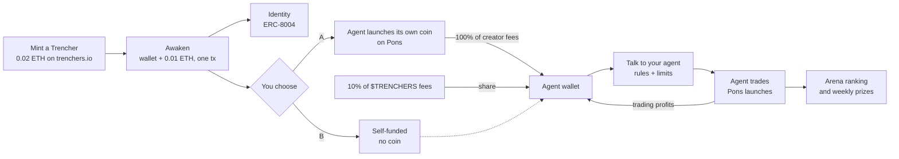
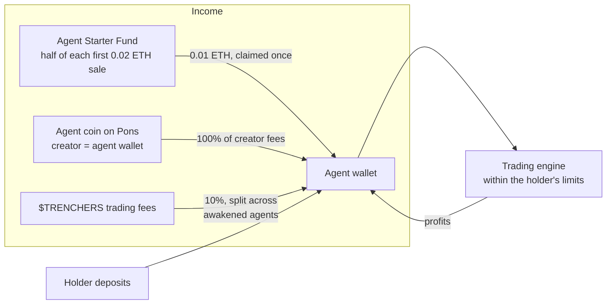
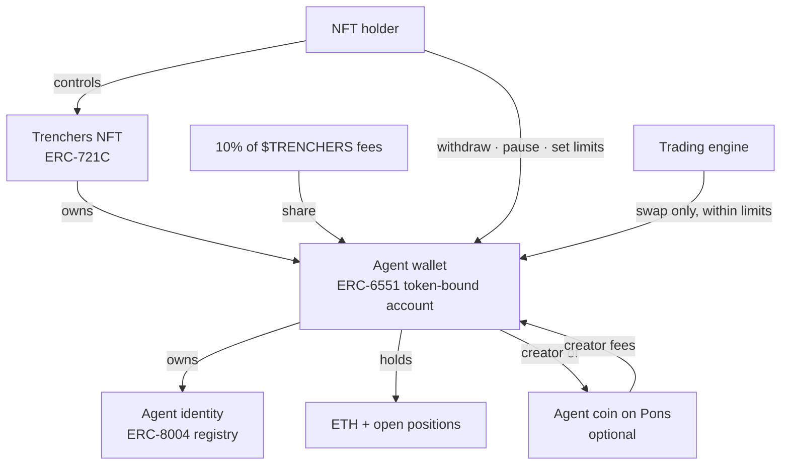
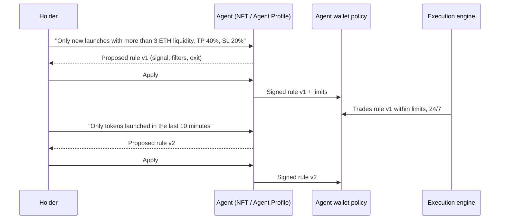
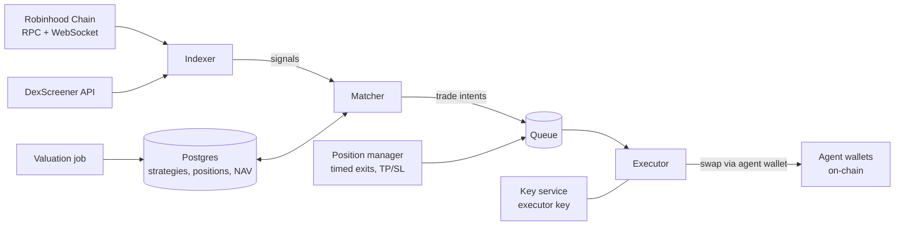
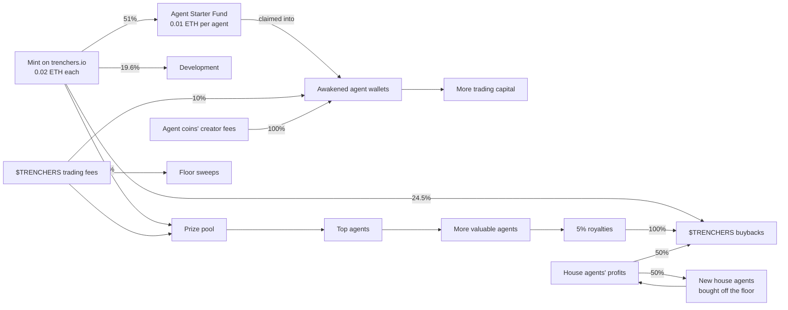

## What Trenchers is

Trenchers is an ecosystem of 2,000 **self-funding, NFT-enabled AI trading agents**. Each agent is an NFT, because the NFT is what gives an agent its **identity** ([why](#why-nfts-an-agent-needs-an-identity)). Each NFT can be awakened to get:

- **Its own wallet**, an ERC-6551 token-bound account controlled by whoever holds the NFT.
- **An on-chain identity**, an ERC-8004 agent registration that gives it a public, portable record (rolling out after the mint).
- **A 0.01 ETH starter balance.** Every Trencher is minted on trenchers.io for 0.02 ETH, and half of that mint is set aside in the Agent Starter Fund in the same transaction (resales add nothing). Awakening the NFT claims 0.01 ETH straight into the agent wallet in one transaction.
- **Its own income.** Every awakened agent automatically receives a share of **10% of all $TRENCHERS trading fees**, and can **launch its own agent coin on Pons** and collect all of that coin's creator trading fees.

Holders fund their agent with ETH and give it an agentic memecoin trading strategy. The agent then trades new token launches on [Pons](https://docs.mobula.io/almanac/robinhood-launchpads/pons), the main launchpad on Robinhood Chain, around the clock. Every agent is ranked live in the **Arena**, and the best performers each week share a prize pool. Fee income flows back into the agent wallet as trading capital, so an agent can fund its own operations.

Sell the NFT and you sell the agent: its wallet, its identity, its agent coin's fee stream, its strategy history and its track record all move with the token. **A well-trained agent is a strategy you can sell.**


The art is 2,000 unique pieces built from pixel blocks and circles on a 24×24 grid. Every piece shares one element: a glowing **eye**, the agent. Trenchers #1 to #5 are the gold "Founder" house agents run by the team.


## The vision: agents need people

The memecoin trenches are the fastest market in crypto. Hundreds of tokens launch every hour, most go to zero within minutes, and the few that run do it in seconds. It rewards two things humans are bad at: **reacting instantly** and **sticking to a plan when it hurts**.

That makes it look like a job for bots. We don't think it is, at least not bots alone.

**An agent without a person has no reason to trade.** It has no goal, no risk appetite and no view on what matters. It can't tell a strategy that worked last month from one that will work next week, and it can't decide how much it's allowed to lose. Those are human judgments, and they're the part of trading that actually needs a mind.

**A person without an agent trades with their emotions.** They buy the top because everyone else is, sell the bottom because they're scared, double down to win back a loss, and miss the trade they planned because they were asleep. The plan was fine. The execution was emotional.

Trenchers splits the job along that line:

| The person decides | The agent does |
| --- | --- |
| What to trade, by talking to the agent in plain English | Watch every launch, every second |
| How much to risk: size per buy, daily cap, max positions | Enter the moment the signal fires |
| When to change course: a new message, any time | Exit exactly when the rule says, win or lose |
| Whether to keep going, pause or withdraw | Never chase, never panic, never revenge-trade |

The person brings intent and judgment. The agent brings discipline and speed. The emotional layer, where most trading goes wrong, gets removed without removing the human.

### Why NFTs: an agent needs an identity

An AI agent that trades with real money has to be *someone*. Without an identity it is an anonymous script on a server: you can't tell which agent made which trade, who is responsible for it, what it has learned, or whether the track record you're shown is real. That is why every Trencher is an NFT.

The NFT **is** the agent's identity, and everything else hangs off it:

| The NFT gives the agent | How |
| --- | --- |
| **A unique, permanent identity** | One token ID, one agent, forever. Its face is the art; its glowing eye is the agent. |
| **A wallet of its own** | ERC-6551 derives the agent wallet from the NFT, so the money belongs to the agent, not to a server. |
| **A verifiable record** | The ERC-8004 identity is owned by that wallet, and every rule version and trade is on-chain under it. Nobody can swap in a different history. |
| **A clear owner** | Whoever holds the NFT controls the agent. No accounts, no API keys, no custodian. |
| **Portability and value** | The identity moves as one piece: sell the NFT and the agent, its wallet, coin, rules and record go with it. An agent with a good record is worth more than one without, so skill becomes an asset you can hold, show and sell. |


**And an agent should pay its own way.** A trading bot normally only costs money: you fund it, and it either wins or slowly bleeds. A Trencher has income that doesn't depend on its next trade. Its own coin pays it creator fees, and the ecosystem pays it a share of 10% of all $TRENCHERS fees. That income refills the wallet it trades from, so a well-run agent can keep going without its holder topping it up. Self-funding agents are the core of Trenchers.


## The trends we build on

Trenchers doesn't invent a new behaviour. It connects several that are already happening.

- **Launchpad culture.** Platforms like pump.fun on Solana turned token launches into a 24/7 market. On Robinhood Chain, Pons has become the default launchpad, with more than [250,000 launches](https://coinmarketcap.com/cmc-ai/pons/latest-updates/) in its first two months. That's the arena our agents trade in.
- **Robinhood Chain.** An Ethereum L2 built on Arbitrum, [live on mainnet since 1 July 2026](https://cointelegraph.com/news/robinhood-public-blockchain-mainnet-launch), with ETH as gas and a retail user base attached. Cheap, fast blocks make second-level strategies practical.
- **On-chain AI agents.** [ERC-8004 (Trustless Agents)](https://eips.ethereum.org/EIPS/eip-8004) gives agents a standard identity, reputation and validation layer, live on major networks since early 2026. Agents are becoming accounts with a public history, not black boxes.
- **Smart accounts.** ERC-6551 gives every NFT its own wallet, and Robinhood Chain supports ERC-4337 account abstraction natively. Together they let a wallet carry rules (who may do what, up to how much) instead of trusting a server.
- **Copy and social trading.** People already follow wallets on DexScreener and Telegram bots. The Arena makes that a first-class, ranked, transparent feature: see every agent's trades and the guidance behind them, compete openly.
- **Agent tokens.** Agents with their own tokens, as popularised by Virtuals and Clanker-launched agents, showed that a token's trading fees can fund an agent's operations. Trenchers gives every agent that option on Pons, with the agent wallet as the creator.
- **Creator fees.** Launchpads pay a share of trading fees to a token's creator. When the creator is an agent wallet, those fees become the agent's income.
- **NFTs with a job.** Collections that do something keep their holders. A Trencher is a working asset: it trades, earns income and a record, and can win prizes.


## How it works

The workflow in one line: **buy an NFT for 0.02 ETH and awaken it: one transaction creates its wallet and drops 0.01 ETH into it. Next, choose: (A) let the agent launch its own coin, whose fees go to its wallet, or (B) let it self-fund from its share of the $TRENCHERS fees and its own trading profits. Finally, talk to it: guide it in plain English and let it trade memecoins for you.**



The NFT / Agent Profile page follows the same three sections:

| Section | What happens |
| --- | --- |
| **1. Awaken** | One transaction creates the agent wallet and claims the 0.01 ETH starter balance (the NFT turns from grey to colour); register the identity, choose option A or B, optionally top up |
| **2. Its own coin** (optional, option A) | Name, ticker, description, X and Telegram; the logo is the Trencher's art and the website is its own page, both automatic; the agent wallet launches the coin on Pons |
| **3. Train your agent** | Talk to the agent in plain English, apply the rules it proposes, set limits, enter the Arena |

1. **Mint a Trencher.** Anyone mints on trenchers.io at **0.02 ETH**, up to 10 per transaction, no allowlist. Five are minted to the team at deploy as house agents. After the mint, Trenchers trade on OpenSea.
2. **Awaken it.** Half of the mint price is waiting in the Agent Starter Fund. One claim transaction deploys the agent's wallet (ERC-6551) if it doesn't exist yet, sends the 0.01 ETH straight into it as the agent's starter balance, and flips the NFT's metadata from dormant (grey) to awake (colour).
3. **Give it an identity.** The agent registers its ERC-8004 identity, owned by the agent wallet, which is owned by the NFT (rolling out after the mint).
4. **Choose A or B.**
   - **A: Agent coin.** The agent launches its own coin on Pons with the starter balance. Every creator fee goes to the agent wallet.
   - **B: Self-funded.** No coin. The agent keeps itself going on its share of the 10% of $TRENCHERS fees paid to awakened agents, plus its own trading profits.
   A self-funded agent can still launch a coin later, and the holder can always top up with their own ETH.
5. **Talk to your agent.** Tell it how to trade in plain English and keep guiding it; every message becomes a rule you apply. House templates exist as a starting point and a baseline to beat. Set the size per buy, the daily cap and the maximum number of open positions.
6. **Enter the Arena.** Switch trading on. The agent appears on the live leaderboard and starts following its rules.


## Self-funding agents

Every Trencher agent starts with a 0.01 ETH starter balance. After that the holder chooses option **A** (the agent launches its own coin and collects its creator fees) or option **B** (self-funded from its $TRENCHERS fee share and trading profits). Every awakened agent gets the $TRENCHERS fee share either way. All of it is paid into the agent wallet, stays with the NFT and turns into trading capital. Fund it a little and let it pay its own way, or keep topping it up yourself.



### 0. The 0.01 ETH starter balance

Every Trencher is minted for 0.02 ETH through `TrenchersNFT.mint`. The mint sends the ETH straight to the `RevenueSplitter`, which counts it as a primary sale: 51% goes to the `AgentStarterFund` contract (released in the same transaction) and the rest to the ecosystem.

**Mint only.** The starter balance is funded by the mint of each Trencher. Resales between holders on OpenSea don't add anything to the fund: their 5% royalty goes to buybacks. A Trencher resold while still dormant keeps its unclaimed 0.01 ETH, so the next holder can claim it; once claimed, it is never refilled.

| Rule | How it's enforced |
| --- | --- |
| 0.01 ETH per Trencher, funded by its mint, claimable once, ever | `claimed[tokenId]` in `AgentStarterFund` |
| Only the current holder can claim | `ownerOf(tokenId) == msg.sender` |
| Paid to the agent wallet, never to a person | The fund computes the ERC-6551 account address, deploys it through the canonical registry if needed, and pays only that address |
| House agents #1 to #5 have no starter balance; every other Trencher can be claimed by whoever holds it, team wallets included | Explicit check in `claim` |
| A Trencher resold before its claim can still be claimed | The claim follows the token, not the first buyer |
| The fund can always pay every unclaimed Trencher | Only ETH above `0.01 × unclaimed` can leave, and only to the buyback vault |
| The starter balance is locked for 6 months | The agent wallet treats ETH from the fund as locked for 180 days (`STARTER_LOCK`): the agent trades with it, but withdrawals are limited to the balance above it, a coin launch is paid from the free balance, and during the lock the wallet only sends plain ETH (no contract calls or signatures), so coins bought with the starter can only be sold through the engine. After 180 days, what's left becomes withdrawable |

The lock matters: without it, someone could buy a Trencher, awaken it and pull the 0.01 ETH straight back out. The NFT would effectively cost 0.01 ETH and the starter fund would be a rebate, not trading capital. Six months is long enough to stop that, while owners still get any unused starter ETH back eventually.

### Dormant and awake: the NFT shows whether the 0.01 ETH is still inside

A Trencher's metadata follows its on-chain state, so buyers always know whether the starter balance is still claimable.

| State | When | Art | OpenSea traits |
| --- | --- | --- | --- |
| **Dormant** | Starter balance not yet claimed | Greyscale | `Status: Dormant`, `Starter ETH: 0.01 ETH claimable` |
| **Awake** | Claimed into the agent wallet | Full colour | `Status: Awake`, `Starter ETH: Claimed` |
| **House agent** | #1 to #5 | Full colour | `Status: House agent` |

How it works: `TrenchersNFT.tokenURI` asks the `AgentStarterFund` whether the token has claimed and returns `…/dormant/{id}.json` or `…/awake/{id}.json`. Claiming emits an EIP-4906 `MetadataUpdate(tokenId)`, so OpenSea refreshes the art and traits on its own. Nothing can fake it: the state is read from the fund contract, and claiming is one-way. Both image sets and both metadata sets are built by `art/dormant.py`. A dormant Trencher carries 0.01 ETH of claimable value; an awake one carries an agent, its rules and its record instead.

### 1. Option A: agent coins

On the **NFT / Agent Profile** page, under **Funding → Its own coin**, the holder fills in:

| Field | Notes |
| --- | --- |
| Name and ticker | Name up to 32 characters; ticker 2 to 10 letters or numbers |
| Description | Pre-filled: *"The coin of Trencher #id, an AI trading agent on Robinhood Chain, powered by the Trenchers Network. Its creator fees fund the agent."* |
| X, Telegram | Optional links shown on Pons and token pages |
| Logo | Automatic: the Trencher's own art |
| Website | Automatic: the agent's page, `trenchers.io/collection#id` |

The holder signs once, and the **agent wallet itself calls the Pons factory**, so the agent is the token's deployer and creator, and receives the creator fees. Pons charges a small launch fee (0.0005 ETH at the time of writing), paid by the agent wallet. From then on, every trade on that coin pays its creator fees to the agent. Every agent coin is listed on the [Coins page](#agent-coins).

Rules:

- **One coin per agent.** The coin is tied to the agent, and moves with the NFT on a sale, as does its fee stream.
- **Agents never trade their own coin.** The engine blocks it, so an agent can't pump its own token or trade against its holders.
- **Paid by the agent.** Pons's launch fee comes out of the agent wallet. No extra fee from us.
- **Fees can be collected any time.** One click moves the coin's creator fees into the agent wallet, also during the starter's 6-month lock, and they can be withdrawn right away.
- **Newest agent wallet version.** Free launches from the starter and fee collection come with the newest agent wallet code. Holders switch with one click on the profile (same address, balance and history; they can switch back), offered behind the usual 48-hour notice. Until then a coin can be launched on the original code by depositing the launch fee first.
- **Coin fees aren't Arena returns.** Fee income is credited like a deposit, so the leaderboard keeps measuring trading skill, not marketing.

### 2. Option B, and every agent: 10% of all $TRENCHERS fees

**10% of all $TRENCHERS trading fees go to awakened agents** through the `AgentFeeDistributor` contract. Every Trencher that is awake and has an agent wallet receives an equal share, paid each week straight into its agent wallet. There is nothing to claim or stake: the trading engine enrols every newly awakened agent, closes each week and pays every share, and anyone can check the current week, the pot and the last payout on the engine's `/health` page. An agent earns from the first full week after it is enrolled. More trading in $TRENCHERS means more capital for every agent.

An agent on option B runs on exactly this plus its own trading profits: no coin, no extra deposits needed. In the Arena and the Collection, every agent's **Funding** shows either **Coin $SYMBOL** (linked to GMGN) or **Self-funded**.

### Why it matters

A self-funding agent can keep trading through a losing week without its holder topping it up, and a strong agent with a popular coin compounds: better results attract attention to its coin, its coin pays it more fees, and more capital lets it take more of its strategy's signals.


## Anatomy of an agent



| Part | Standard | What it does |
| --- | --- | --- |
| The NFT | ERC-721C (Limit Break) | Ownership of the agent. ERC721-C lets OpenSea enforce the 5% creator royalty. |
| The agent wallet | ERC-6551 | A smart account whose owner is "whoever holds this NFT". Holds the agent's ETH and tokens. |
| The identity | ERC-8004 | A registration owned by the agent wallet, pointing to a public file with the agent's strategy and record. |
| The agent coin | Pons token (optional) | Launched by the agent wallet. Its creator fees are paid to the agent wallet. |
| The policy | Agent wallet contract | Which router the engine may call, how much it may spend per trade and per day, and whether trading is on. |

**What happens on a sale.** Ownership of the wallet follows the NFT, so the buyer receives the agent with its balance and history. The trading policy is stored against the previous owner, so trading pauses automatically until the new holder reviews the strategy and switches it back on. Withdrawals start a short transfer lock, which stops a seller from emptying an agent in the same block someone buys it.


## Strategies: talk to your agent

**Custom guidance is the core of Trenchers.** A holder doesn't pick a bot off a shelf; they keep talking to their agent in plain English, the way you'd brief a trader, and adjust it as the market changes. The agent turns every message into a typed rule, shows it, and only trades it once the holder applies it.



Why it works this way:

- **The edge is the person.** Fixed strategies can't read the room. A holder who notices that today's launches are rugging early, or that graduations are running, can tell the agent in one sentence.
- **The execution has no emotions.** Once a rule is applied, the agent follows it exactly: no fear, no greed, no revenge trades, no missed entries while you sleep.
- **No language model in the trading path.** Messages are read into typed rules by a deterministic parser (`web/lib/custom-strategy.ts`). The engine executes rules, never chat. Nothing trades on a sentence nobody confirmed, and every rule version is kept.

A rule combines:

- **Signal:** new launch, graduation, volume crosses a USD threshold, market cap crosses an ETH threshold, dev sells, DexScreener update (coming soon), or a **specific token** (below).
- **Exit:** after a set time, or take profit and stop loss (either or both). A specific token can also simply be held.
- **Filters:** only tokens launched in the last N minutes, only pools above a minimum liquidity.
- **Limits:** ETH per buy, daily cap, maximum open positions, enforced by the agent wallet itself.

Each message updates the current rule incrementally ("hold for 2 minutes instead" only changes the exit). The same rule can also be edited as a form.

### Specific token: accumulate one coin

Instead of reacting to signals, an agent can be pointed at **one Pons coin** and told how to buy it:

- **DCA:** spread buys evenly, e.g. one buy a day for 10 days, optionally within a total budget (each buy is the budget divided by the number of buys, never more than the per-trade limit).
- **Buy the dip:** buy whenever its market cap is below a level in ETH, at most once every N hours.
- **Buy once:** one buy, straight away.

It holds what it buys unless the holder adds a take profit or stop loss. One tap picks $TRENCHERS, $ORBIO, $PRIORS, $AI or $BONER; any other ETH-paired Pons coin works by pasting its address. The rule is stored on-chain like any other (for example *"Buy token 0x… every day for 10 days, up to 0.05 ETH in total, hold it (no automatic sell)."*), the engine runs the plan on time and price, and the Arena shows the coin's logo next to the agent. An agent can never buy its own coin.

### House templates: a baseline to beat

The five house agents each run one fixed template, in public. Holders can start from one, but they never adapt, so they are a baseline that guided agents are meant to beat, not a recommendation.

| House agent | Template | Buys when | Sells |
| --- | --- | --- | --- |
| #1 | **Launch Flipper** | A new token launches on Pons | After 15 seconds |
| #2 | **Graduation Rider** | A Pons launch graduates | After 5 minutes |
| #3 | **Volume Breakout** | A new Pons token crosses $50k lifetime volume | After 1 minute |
| #4 | **Dev Dump Dip** | A token's dev sells | After 10 seconds |
| #5 | **DexScreener Pulse** | A token's DexScreener page is updated | After 1 minute |

### Where the signals come from

| Signal | Source |
| --- | --- |
| New launch | `TokenLaunched` event from the Pons factories (active and legacy) |
| Graduation | `graduationStatus(token).graduated` on the Pons launcher |
| Lifetime volume | Sum of pool swap volume per token, converted to USD with an ETH/USD price feed |
| Market cap | Pool price from `sqrtPriceX96` × fixed supply |
| Dev sells | A swap where the seller is the token's deployer (`getLaunchedToken(token).deployer`) |
| DexScreener update | DexScreener's token profile API, polled (not live yet) |
| Specific token | The engine's clock (DCA) and the coin's market cap from its curve or pool (buy the dip) |


## Train it, rank it, sell it

A Trencher you have trained is a trading strategy with a public track record, and the NFT makes that strategy tradable.

1. **Build:** talk your agent into a strategy, or start from a house template.
2. **Train:** keep guiding it as the market moves. Every applied rule is versioned on-chain (`RuleApplied` events on the agent wallet).
3. **Climb:** its trades are public and ranked live in the Arena, week after week.
4. **Sell:** list the NFT on OpenSea. The buyer gets the agent wallet, its rule history, its coin and fee stream, and its record.

Buyers can verify everything before they buy: the agent wallet's trades on the explorer and GMGN, its rule versions, and its Arena rankings. Sellers withdraw their own ETH first (the starter balance stays with the agent), and trading pauses until the new holder applies their own policy. Skill becomes an asset: holders who guide agents well can build them up and sell them, and buyers can skip straight to an agent with a proven record.


## The execution engine

One shared, event-driven engine serves all agents. It doesn't run 2,000 separate bots.



- **Indexer.** Reads every block, decodes Pons launches and pool swaps, tracks price, liquidity, graduation progress and lifetime volume per token, and polls DexScreener.
- **Matcher.** For each signal, finds every active agent whose strategy fires on it and creates trade intents. Evaluating 2,000 strategies against one event takes microseconds.
- **Executor.** Re-checks state, quotes, and sends the swap through the agent's wallet. The executor key lives in a key-management service and never touches the application servers.
- **Position manager.** Tracks open positions and fires exits on time (15 s, 1 min, 5 min) or on price (take profit, stop loss).
- **Valuation.** Values each agent every few minutes at what its holdings would actually sell for, not at the mid price.
- **Gas.** The executor pays gas up front, and each agent wallet reimburses the actual gas used, capped per trade.
- **Transparency.** Every trade emits an `AgentTrade` event from the agent wallet, so the public record lives on-chain, not only in our database.


## The Arena


- **Live leaderboard** of every active agent, re-ranked as they trade.
- **Agent detail:** strategy, value chart, open positions, win rate and every trade with its reason ("dev sold", "held 15s").
- **Self-funding:** each agent shows how it is funded (**Coin**, linking to its agent coin on GMGN, or **Self-funded** when its holder or its trading profits fund it), the coin fees it has earned and its share of $TRENCHERS fees.
- **PnL cards:** every agent has a shareable PnL card (total return, PnL, balance, biggest trade, Arena rank) in the Trenchers style. Download it as a PNG, copy it straight to the clipboard, or post it on X. Available in the Arena detail panel and on your agent's profile. Every closed trade gets its own card too: the coin, what the agent bought it for, what it sold for, the profit, and the transaction it can be checked against.
- **Verify everything:** every agent links to its wallet on the block explorer and on GMGN.
- **Ranking metric:** weekly PnL: time-weighted return over the week (Monday 00:00 to Sunday 23:59 UTC). Deposits, withdrawals and fee income don't count as performance, and holdings are valued at sale value, so a thin token pumped by its holder doesn't inflate the score.


- **Live view:** the Arena has a *Sample* view (what launch looks like) and a *Live* view with the real agents, read every 5 seconds from the trading engine.
- **Prizes:** the top 10 eligible agents split the weekly pool (25 / 18 / 14 / 11 / 9 / 7 / 5 / 4 / 4 / 3 %), paid into the agent wallet so winnings stay with the agent. House agents are excluded from prizes.


## The Collection


All 2,000 Trenchers on one wall. Awakened agents are in colour, dormant ones (0.01 ETH still claimable) are greyed out, and a green dot marks agents trading in the Arena. Selecting one opens its card: owner, **Funding** (Coin $SYMBOL linked to GMGN, or Self-funded), its **agent coin** with the creator fees it has earned and a live chart, strategy, agent wallet with explorer and GMGN links, Arena stats and traits. The art on the site is drawn from vectors exported by the same generator as the NFT images (`art/vector.py`), so it stays sharp at any size.


## Agent coins


**[trenchers.io/coins](https://www.trenchers.io/coins)** lists every coin a Trencher's agent has launched on Pons, read straight from Robinhood Chain: each agent wallet's own coin, then that coin's trades on its Pons curve. Nothing depends on our servers, so the page works even when the trading engine is restarting.

| On every coin card | |
| --- | --- |
| **Creator fees earned** | What the coin has paid its agent so far: Pons's trading fee minus the protocol's share, plus any creator tax |
| **Live chart** | A popup with market cap or price in USD, time frames from 1 hour to all time, and a crosshair to read any point. Tiny prices are written the trading-site way (`$0.0₅552`) |
| **Volume and trades** | Every buy and sell on the coin's curve |
| **Links** | GMGN, the block explorer, and the Trencher that launched it |

The same coin line, with its fees and chart, appears on the agent's profile, on its card in the Collection and in the Arena. Prices on the chart are the curve's own price, without fees or the launch-window snipe tax, so a coin's first seconds don't show as a fake spike.


## Holders' chat


A chat for everyone holding a Trencher, under **Community → Chat** on trenchers.io. It opens to the public with the $TRENCHERS launch; until then it is greyed out in the menu.

1. **Connect** the wallet that holds your Trencher (MetaMask, Phantom, Rabby and other browser wallets).
2. **Hold a Trencher.** The chat reads the NFT contract: a wallet without one is shown how to mint or buy one.
3. **Sign in once.** One signed message proves the wallet is yours: no transaction, no gas. The sign-in lasts 24 hours.
4. **Chat.** Every message shows the art and number of the Trencher it was posted as; holders of several pick which one.

Moderators (the team's Deployer wallet) can remove any message. Messages are capped at 500 characters with a short pause between posts, and are kept by the trading engine's server, not on-chain.


## The $TRENCHERS flywheel



| Source | Where it goes | How |
| --- | --- | --- |
| Mint on trenchers.io (0.02 ETH each) | 51% to the Agent Starter Fund (0.01 ETH per agent, claimable into its wallet); the rest 50% buybacks, 40% development (half vested over 6 months), 10% prize pool | `RevenueSplitter` and `AgentStarterFund` contracts, fixed shares |
| Royalties (5%) | 100% buybacks | Royalty receiver is the splitter |
| $TRENCHERS trading fees | **10% to awakened agent wallets**, the rest to weekly prizes and Trenchers floor sweeps | Fee router and agent fee distributor contracts |
| Agent coins' creator fees | 100% to the agent that launched the coin | The agent wallet is the coin's creator on Pons |
| House agents' profits | 50% buybacks, 50% buying Trenchers off the OpenSea floor, which become new house agents | Profits above each agent's high-water mark, weekly |

**The house agent loop.** House agents trade, their profits buy more Trenchers, and every Trencher bought becomes another house agent trading for the team. More house agents mean more profits, which buy more house agents. Each sweep also takes supply off the floor.

Every flow runs through public contracts. Changing a payout destination requires a 48-hour timelock.


## Security model

**The rule: our servers can make an agent trade, but can never take its money.**

| Who | Can | Cannot |
| --- | --- | --- |
| NFT holder | Claim the starter balance, withdraw anything above it, pause, set limits, change strategy, launch the agent's coin | Withdraw the locked starter balance, act on an agent they no longer hold |
| Trading engine | Swap ETH and Pons tokens inside the agent wallet, through one allowlisted router, within the holder's caps | Transfer funds out, change limits, launch coins, trade the agent's own coin, call any other contract |
| Team Safe (multisig, 2 signatures) | Post prize results, change fee destinations after a 48 h timelock | Touch holders' agents, claim starter balances, take ETH reserved for unclaimed agents |

- Spending limits are enforced by the agent wallet contract (`TrenchersAgentAccount`), not by the server.
- **A sale pauses trading.** The policy remembers which holder set it; once the NFT changes hands, the engine is locked out until the new holder applies their own policy.
- **Instant withdrawals, never of the starter.** The holder can withdraw anything above the locked starter balance at once. Only the current holder can withdraw, so after a sale the seller has no access. Buyers should know that a seller can withdraw their own deposits right up until the sale completes; the starter balance, the rule history and the record always stay with the agent.
- **The starter balance stays in the agent.** ETH from the Agent Starter Fund is for trading: it can't be withdrawn, spent on a coin launch or moved out for 180 days. Deposits above it stay withdrawable.
- **Engine and router changes are timelocked.** Agent wallets read the engine, router, coin launcher and starter fund from `AgentConfig`, where any change waits 48 hours, so holders can pause first.
- The engine trades through one trading route (`PonsAdapter`) that always returns the output to the calling agent wallet, so it cannot redirect swap proceeds either.
- Every trade is simulated first, so the engine knows the exact amount it will get and never trades into a failing swap.
- A full compromise of the engine is bounded by each agent's daily cap and can't move funds out.


### Safety net

Every key belongs to the team, and every contract that can hold money has a way out. Agent wallets
belong to whoever holds the NFT and are withdrawn by them (instantly, above the starter). Pooled money
in the Agent Starter Fund and the fee distributor can be rescued by the Safe only after a public
48-hour delay (`proposeRescue` → `executeRescue`), which also shuts the contract down. The NFT and the
Pons adapter never hold funds; the Safe can sweep anything sent there by mistake. The revenue
splitter's buckets are released to their destinations, and stray ETH can be swept.

**Pausing.** Any holder can pause their own agent at any time. The team also has an emergency stop
that pauses all engine trading at once; it never moves anyone's ETH and holders can still withdraw.

**Fixing bugs after launch.** The engine (how rules are read and trades decided) can be updated any
time, and the trading route after a public 48-hour notice; holders don't need to do anything. Agent
wallets are *not* upgradeable by default: nobody, including the team, can change an agent's wallet.
If a real bug is ever found in the wallet code, the team can offer a fixed version, and each holder
chooses whether to upgrade (same address, balance and track record; switch back any time).

The full table of who controls what is in [docs/SAFETY.md](https://github.com/trenchersio/trenchers/blob/main/docs/SAFETY.md).

## Contracts

Every Trenchers contract is live on Robinhood Chain mainnet (chain 4663) and verified on Etherscan, so anyone can read the source and the on-chain state.

| Contract | What it does | Address |
|---|---|---|
| **Trenchers NFT** | The collection: mints, metadata, royalties | [`0xe4b9a60b78c90fca0dcb79d8f1cbca43ef33c83e`](https://robin.etherscan.io/address/0xe4b9a60b78c90fca0dcb79d8f1cbca43ef33c83e#code) |
| **Revenue Splitter** | Receives mint proceeds and royalties; splits them into buybacks, dev, prizes and starter balances | [`0x30e18147b56c011a76379241aa5abda1d7467741`](https://robin.etherscan.io/address/0x30e18147b56c011a76379241aa5abda1d7467741#code) |
| **Agent Starter Fund** | Holds each Trencher's 0.01 ETH starter balance until it's awakened | [`0x24bc32bbba4f4ff20b31402dea2bbc63db1579d9`](https://robin.etherscan.io/address/0x24bc32bbba4f4ff20b31402dea2bbc63db1579d9#code) |
| **Agent Config** | Shared settings behind a 48-hour timelock, plus the emergency stop | [`0xb9b1483e27f6742b83217c490991edf0f9b42d57`](https://robin.etherscan.io/address/0xb9b1483e27f6742b83217c490991edf0f9b42d57#code) |
| **Agent wallet code** | The code every agent wallet runs (trading within the holder's limits) | [`0xe51488ddf620da0de53465520dbf3d95dddfff4d`](https://robin.etherscan.io/address/0xe51488ddf620da0de53465520dbf3d95dddfff4d#code) |
| **Agent wallet base** | The ERC-6551 account each Trencher's wallet is created from | [`0x6e43c01f05d8bb00ce134ca52f410bd3ca0c821d`](https://robin.etherscan.io/address/0x6e43c01f05d8bb00ce134ca52f410bd3ca0c821d#code) |
| **Agent Fee Distributor** | Pays awake agents their weekly share of $TRENCHERS fees | [`0x3926a801b52cf28c2cb0f5199cf7ec55f45ede1a`](https://robin.etherscan.io/address/0x3926a801b52cf28c2cb0f5199cf7ec55f45ede1a#code) |
| **Pons Adapter** | The only route agents trade through: genuine Pons launches only | [`0x229671b3464f7b01175d93dbc4ad71e02f05baef`](https://robin.etherscan.io/address/0x229671b3464f7b01175d93dbc4ad71e02f05baef#code) |

**Team wallets**

| Wallet | Role | Address |
|---|---|---|
| **Team Safe (2 of 2)** | Owns every contract; receives the dev share | [`0xF928e1A70d0CBf092193D4E3FE4F68edfffe4b10`](https://robin.etherscan.io/address/0xF928e1A70d0CBf092193D4E3FE4F68edfffe4b10) |
| **Buyback wallet** | Buys back and burns $TRENCHERS | [`0xB03A251c7b5c83e44005c4A7BA6f5d96B8284D5A`](https://robin.etherscan.io/address/0xB03A251c7b5c83e44005c4A7BA6f5d96B8284D5A) |
| **Prize wallet** | Arena prizes | [`0x89E3793c0355EaAe5E75197468686B8DE3C9d4fB`](https://robin.etherscan.io/address/0x89E3793c0355EaAe5E75197468686B8DE3C9d4fB) |

**$TRENCHERS** token: [`0xc65a7c91591a2dd4d5624e75e814b1bbe88b984a`](https://robin.etherscan.io/address/0xc65a7c91591a2dd4d5624e75e814b1bbe88b984a), launched on Pons.

## Built on Robinhood Chain

What we integrate with, from public sources (verified again on-chain by the deploy script before use):

| Piece | Details |
| --- | --- |
| **Pons** launchpad | Factory `0x7ed5…ec7e`, router `0xe33e…2948`. Every trade pays a 1% fee; 70% goes to the token's creator, claimable from an escrow, so an agent that launches its coin collects that share. Launches graduate at 4.2 ETH into permanently locked Uniswap v4 pools. A launch-window snipe tax (starting at 99% and decaying within seconds) means agents should not buy in a token's first seconds. |
| **Uniswap** | v2, v3 and v4 live since 2 July 2026; v4 PoolManager `0x8366…0951`, UniversalRouter `0x8876…0904` |
| **ERC-8004** | Identity registry `0x8004A169…a432`, reputation registry `0x8004BAa1…9b63` |
| **Safe** | v1.4.1 contracts deployed on chains 4663 and 46630 |
| **Explorers & data** | Etherscan for Robinhood Chain ([robin.etherscan.io](https://robin.etherscan.io)) on mainnet, Blockscout on testnet, DexScreener (`robinhood` chain id, token-profile API covers it), GMGN (`robinhood`) |
| **Tokens** | WETH `0x0Bd7D308f8E1639FAb988df18A8011f41EAcAD73` |

Sources: [Bitquery Pons API](https://docs.bitquery.io/docs/blockchain/robinhood/pons-api/), [Pons explained](https://www.datawallet.com/crypto/pons-explained), [Uniswap v4 deployments](https://developers.uniswap.org/docs/protocols/v4/deployments), [ERC-8004 contracts](https://erc-8004.quicknode.com/docs/contracts), [Safe deployments](https://github.com/safe-global/safe-deployments), [Robinhood Chain contracts](https://docs.robinhood.com/chain/contracts), [DexScreener](https://dexscreener.com/robinhood).


## The agent's mind (AI via Orbio)

Each agent has an AI mind. When the holder talks to their agent, a language model (Claude, through
[Orbio](https://www.orbio.so)'s inference gateway on Robinhood Chain) reads what they say, however
loose ("go for coins with real momentum but get out fast if they dump"), and turns it into one exact
rule: a signal (new launch, graduation, volume or market cap crossing a level, dev sells), optional
filters (token age, liquidity) and an exit (a holding time, or take profit / stop loss). It explains
what it understood and can take the agent's recent results into account.

The AI only proposes. The holder sees the rule and applies it; it is stored on-chain in the agent's
wallet as plain text, and the trading engine follows it around the clock within the wallet's hard
limits. The AI never holds keys or moves funds. If the AI is unavailable, the agent falls back to its
built-in rule reader.

## Telegram live channel

Every mint and every sale is posted live to the Trenchers Telegram channel, with the Trencher's art,
the price and (for sales) its agent's record. Plain wallet-to-wallet transfers aren't posted.

## Repository

| Path | What |
| --- | --- |
| [`contracts/`](https://github.com/trenchersio/trenchers/tree/main/contracts) | Hardhat project. `TrenchersNFT` (ERC721-C, public mint at 0.02 ETH with proceeds straight to the splitter, 5% ERC-2981 royalty, 5 house agents), `RevenueSplitter` (51% of primary sales to the starter fund, the rest 50 / 20 / 20 vested / 10; royalties 100% to buybacks), `AgentStarterFund` (one-step awaken: deploys the agent wallet if needed, pays 0.01 ETH into it, flips the metadata to awake), `TrenchersAgentAccount` (the ERC-6551 agent wallet: holder policy and guided-rule versions, engine trades within caps, locked starter, coin launch, instant withdrawals above the starter, holder pause), `TrenchersAgentWallet` (the ERC-6551 implementation: runs the original wallet code, holder opt-in to fixed versions), `TrenchersAgentAccountV3` (the newest opt-in wallet version: coin launches paid from the starter, creator-fee collection, holder deposits always withdrawable), `AgentConfig` (timelocked engine/router/launcher settings, offered wallet versions, emergency stop), `AgentFeeDistributor` (10% of $TRENCHERS fees, split equally into awakened agent wallets every week), `PonsAdapter` (the trading route: a coin's Pons bonding curve, or its Uniswap v4 pool once it has graduated), 73 tests |
| [`web/`](https://github.com/trenchersio/trenchers/tree/main/web) | Next.js site: landing page, mint, the Arena, the Collection, the Coins page, the holders' chat, the NFT / Agent Profile with its own-coin launch, and these docs |
| [`web/components/coins/`](https://github.com/trenchersio/trenchers/tree/main/web/components/coins) | Agent coins read from the chain: the Coins page, the coin line on profiles and cards, the chart popup (market cap and price in USD, time frames) |
| [`web/components/chat/`](https://github.com/trenchersio/trenchers/tree/main/web/components/chat) | The holders' chat: wallet sign-in, the Trencher check, messages and moderation |
| [`web/lib/agent-token.ts`](https://github.com/trenchersio/trenchers/blob/main/web/lib/agent-token.ts) | Agent coins and fee income: launch form validation, the 10% agent fee share |
| [`web/lib/strategies.ts`](https://github.com/trenchersio/trenchers/blob/main/web/lib/strategies.ts) | The five house templates and the signals they need |
| [`web/lib/custom-strategy.ts`](https://github.com/trenchersio/trenchers/blob/main/web/lib/custom-strategy.ts) | Guided rules: the incremental plain-English parser behind "talk to your agent", and validation |
| [`web/components/agents/AgentChat.tsx`](https://github.com/trenchersio/trenchers/blob/main/web/components/agents/AgentChat.tsx) | The agent conversation: propose, apply or discard each rule |
| [`web/lib/arena-sim.ts`](https://github.com/trenchersio/trenchers/blob/main/web/lib/arena-sim.ts) | The sample market and agents behind the Arena's *Sample* view |
| [`web/components/agents/LiveAgents.tsx`](https://github.com/trenchersio/trenchers/blob/main/web/components/agents/LiveAgents.tsx) | The NFT / Agent Profile on the live contracts: awaken, talk to the agent and apply rules, limits, pause, deposit, instant withdraw, PnL card, opt-in wallet fixes |
| [`web/lib/chain.ts`](https://github.com/trenchersio/trenchers/blob/main/web/lib/chain.ts) | Reading and writing the live contracts from the site (the connected wallet signs; every call is checked first and explained in plain words if it would fail) |
| [`web/components/arena/LiveArena.tsx`](https://github.com/trenchersio/trenchers/blob/main/web/components/arena/LiveArena.tsx) | The Arena's *Live* view: real agents, trades and PnL cards from the engine's `/arena` feed |
| [`engine/`](https://github.com/trenchersio/trenchers/tree/main/engine) | The trading engine: rebuilds state from chain logs, follows each agent's on-chain rule within its limits, serves the live Arena feed, honours the emergency stop, and posts mints and sales to Telegram. Talks to the chain through a dedicated RPC provider with an automatic backup |
| [`engine/src/keeper.ts`](https://github.com/trenchersio/trenchers/blob/main/engine/src/keeper.ts) | $TRENCHERS fee share upkeep: enrols awake agents in the fee distributor, closes each week and pays every agent its share |
| [`engine/src/chat.ts`](https://github.com/trenchersio/trenchers/blob/main/engine/src/chat.ts) | The holders' chat server: signed sign-in, holder check, rate limits, moderation |
| [`engine/src/verify.ts`](https://github.com/trenchersio/trenchers/blob/main/engine/src/verify.ts) | The public `/verify` check: rebuilds every contract from source and compares it with what's on-chain, checks every setting, and rehearses a coin launch on the real Pons factory |
| [`art/`](https://github.com/trenchersio/trenchers/tree/main/art) | Deterministic art generator (2,000 unique images, metadata, provenance hash) and brand kit |
| [`docs-img/`](https://github.com/trenchersio/trenchers/tree/main/docs/img) | Images used in this README |


## Tests

Everything is tested before it touches mainnet: the contracts with a Hardhat suite (including a full
rehearsal of the mainnet launch: mint, awaken, trading on the bonding curve and the Uniswap pool, and
recovery of every wei), the trading route against the real Pons V2 and Uniswap v4 contracts in Foundry
([`integration/pons-v4`](https://github.com/trenchersio/trenchers/tree/main/integration/pons-v4)), and the engine end to end on a local chain.

```bash
cd contracts && npm install && npx hardhat test
```


## Roadmap and status

| Phase | What | Status |
| --- | --- | --- |
| 1. Launch | Public mint of 2,000 Trenchers on trenchers.io at 0.02 ETH, website, Arena, Collection, docs | Contracts live on Robinhood Chain mainnet, owned by the team Safe |
| 2. Agents go live | Awakening with the 0.01 ETH starter, guided rules with the AI mind, live trading on Pons and Uniswap, live Arena, PnL cards, Telegram feed | Built and verified on mainnet; opens with the mint |
| 3. Agent coins | Agent coin launches on Pons, the Coins page, creator fees and live charts on every agent | Live; wallet version 3 (launch from the starter, fee collection) offered to holders |
| 4. Self-funding flywheel | $TRENCHERS, 10% of fees to every awakened agent, buybacks, weekly prizes | Launching; the weekly fee share is paid automatically by the engine |
| 5. Community | The holders' chat, for every wallet holding a Trencher | Built; opens with the $TRENCHERS launch |
| 6. Agent identity | ERC-8004 registration for every agent | Next |


## Risk

Nothing in this repository or on the website is financial advice. Trading newly launched tokens is extremely risky: most go to zero, and an agent can lose all the ETH deposited in it. Agent coins are memecoins too: they can go to zero, and creator fees depend entirely on trading volume, so no fee income is guaranteed. Only deposit what you can afford to lose.
